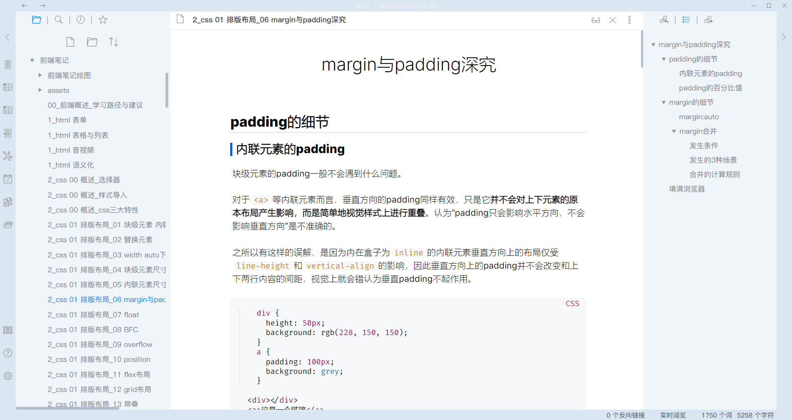

# Neat

一个简洁的Obsidian主题。

## 目标

- 整体配色尽量简洁。秉持「过多的强调就是没有强调」的出发点，配色尽量克制。
- 把控视觉重心，重点突出文档编辑区域。
- 逻辑清晰。尤其是h1~h3级标题样式有足够区分，避免出现如「不知道是几级标题、是标题还是正文加粗」的困惑。

## Demo

## 使用

1. 将`Neat.css`文件放入本地Obsidian库的`.obsidian/themes`目录下。
2. Obsidian中「设置」-「外观」-「主题」中勾选`Neat.css`主题。

##  注意事项

1. 目前仅针对「明亮」主题进行了适配，「暗黑」主题模式尚未适配。
